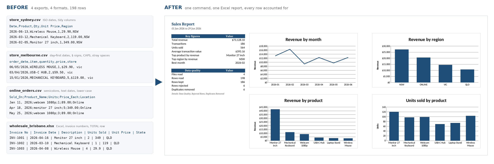
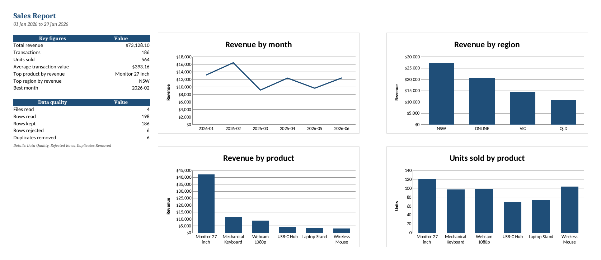

# Sales Report Automation

Turns a folder of messy sales exports (CSV and Excel) into one clean Excel report with one command.



## The problem

A small retailer gets a sales export from each store, from its web shop and from its accounts system. Every file uses different column names, date formats, delimiters and currency formatting. Some rows are exported twice and some are broken. Someone spends hours each month copying everything into one spreadsheet by hand, and mistakes go unnoticed.

## What the script does

1. Reads every `.csv`, `.xlsx` and `.xlsm` file in a folder.
2. Detects the CSV delimiter (comma, semicolon, tab or pipe) and the text encoding.
3. Maps each file's column names to one schema, so `order_date`, `Sold_On` and `Invoice Date` all become `date`.
4. Parses dates in ten formats (`2026-03-12`, `12/03/2026`, `Mar 12, 2026`, real Excel dates, ...).
5. Cleans numbers such as `$1,299.50`, `AUD 45` and `(45.00)`.
6. Gives product names one spelling: `USB-C HUB` and `usb-c hub` become `USB-C Hub`.
7. Sets aside invalid rows with the reason and the row number in the source file.
8. Removes duplicate rows and lists each one next to the row it repeats.
9. Writes a formatted Excel report with key figures, breakdown tables and four charts.

Every input row ends up in exactly one place: the clean data, the rejected rows or the removed duplicates. The `Data Quality` sheet shows the count per file, so the numbers can be checked: rows read = kept + rejected + duplicates.

## Sample run

```
$ python sales_report.py --input data --output report.xlsx
INFO    Loaded online_orders.csv (43 rows)
INFO    Loaded store_melbourne.csv (56 rows)
INFO    Loaded store_sydney.csv (60 rows)
INFO    Loaded wholesale_brisbane.xlsx (39 rows)
INFO    Rejected 6 invalid rows, removed 6 duplicate rows
INFO    Done: 4 files, 198 rows read = 186 kept + 6 rejected + 6 duplicates removed
INFO    Report written to report.xlsx
```

The result is [`report.xlsx`](report.xlsx):



### What is in the report

| Sheet | Contents |
| --- | --- |
| Summary | Total revenue, transactions, units, average transaction value, top product, top region, best month, data quality counts, four charts |
| By Month | Transactions, units, revenue, average transaction value and growth against the previous month |
| By Product | Units, revenue, share of revenue and average unit price per product |
| By Region | Transactions, units, revenue and share of revenue per region |
| Region by Month | Revenue of each region in each month, with a total |
| Clean Data | Every valid row after cleaning, with a filter on each column and the source file and row |
| Data Quality | Per source file: rows read, kept, rejected, duplicates removed, first and last date |
| Rejected Rows | Invalid rows exactly as they were in the source file, with the reason |
| Duplicates Removed | Rows that were dropped, and which row each one repeats |

### What the sample data contains

`make_sample_data.py` generates four files that imitate real exports:

| File | Format | Deliberate problems |
| --- | --- | --- |
| `store_sydney.csv` | Comma-delimited, ISO dates | None |
| `store_melbourne.csv` | Day-first dates, `$` prices, upper-case names, stray spaces | 4 rows exported twice, 1 invalid date, 1 missing quantity |
| `online_orders.csv` | Semicolon-delimited, text dates, lower-case names | 30 February, 1 missing product, 1 negative quantity |
| `wholesale_brisbane.xlsx` | Excel with invoice numbers and real date cells | 2 invoice lines exported twice, a `TOTAL` row, and 1 genuine repeat sale that must be kept |

The data is random and does not describe a real business.

## How to run it

Requires Python 3.10 or newer.

```
pip install -r requirements.txt
python make_sample_data.py      # creates the sample files in data/
python sales_report.py --input data --output report.xlsx
```

### Options

| Option | Default | Meaning |
| --- | --- | --- |
| `--input` | `data` | Folder containing the CSV and Excel files |
| `--output` | `report.xlsx` | Report to create |
| `--config` | none | JSON file with extra column names, date formats or a currency symbol |
| `--keep-duplicates` | off | Keep identical rows instead of removing them |
| `--log-file` | none | Also append the log to this file |
| `--quiet` | off | Print only warnings and errors |
| `--version` | | Print the version |

The command exits with code `0` on success and `1` on an error, so a scheduler can detect a failed run.

## Adapting it to your files

Copy `config.example.json` to `config.json`, edit it and pass it with `--config config.json`. No code changes are needed.

```json
{
  "column_aliases": {
    "date": ["Sale Date", "Datum"],
    "product": ["Article"],
    "quantity": ["Pieces"],
    "unit_price": ["Net Price"],
    "region": ["Branch"],
    "order_id": ["Receipt No"]
  },
  "date_formats": ["%d/%m/%Y", "%Y-%m-%d", "%d.%m.%Y"],
  "decimal_separator": ".",
  "currency_symbol": "$"
}
```

| Setting | Effect |
| --- | --- |
| `column_aliases` | Extra column names for each field. They are added to the built-in ones. Matching ignores case, underscores, hyphens and extra spaces. |
| `date_formats` | Replaces the built-in list. Formats are tried in order, so put `%m/%d/%Y` first for US-style files. |
| `decimal_separator` | `"."` for `1,299.50` or `","` for `1.299,50`. |
| `currency_symbol` | The symbol shown in the report. |

The required fields are `date`, `product`, `quantity`, `unit_price` and `region`. `order_id` is optional.

## How the cleaning rules work

**Rejected rows.** A row is rejected when the date is missing or not a real date, the product is missing, the quantity is missing, not a whole number, zero or negative, or the price is missing, not a number or negative. A row with several problems lists all of them. A row with no region is kept and labelled `(NOT SPECIFIED)`.

**Numbers.** A value is accepted only when it is clearly a number. `1.299,50` read with the wrong decimal separator is rejected and never silently turned into `1.2995`.

**Dates.** `03/04/2026` is read as 3 April by default. Change `date_formats` for month-first files. A file that mixes both styles cannot be read reliably by any tool and should be split first.

**Duplicates.** Two rows are duplicates when every field matches, including the order ID.

- With an order ID, a line exported twice is removed, while two identical sales on different orders are both kept.
- Without an order ID, identical rows cannot be told apart from a genuine repeat sale. They are removed by default and listed in `Duplicates Removed` for review. Use `--keep-duplicates` when repeat sales on the same day are normal.

**Negative quantities** are treated as errors. If your exports record refunds as negative rows, that rule needs changing first.

**Unreadable files** are skipped with a warning and the rest of the run continues.

## Running it on a schedule

Linux or macOS, every Monday at 7 am (`crontab -e`):

```
0 7 * * 1 cd /path/to/sales-report-automation && python sales_report.py --input data --output report.xlsx --log-file run.log
```

Windows, every Monday at 7 am (run once in Command Prompt):

```
schtasks /Create /SC WEEKLY /D MON /ST 07:00 /TN "Sales report" /TR "cmd /c cd /d C:\path\to\sales-report-automation && python sales_report.py --log-file run.log"
```

## Using it from Python

```python
from sales_report import run

result = run("data", "report.xlsx")
print(result.rows_kept, result.rows_rejected, result.total_revenue)
```

## Tests

```
pip install -r requirements-dev.txt
pytest
```

The 75 tests cover date and number parsing, column matching, delimiter and encoding detection, every rejection rule, duplicate handling with and without order IDs, the aggregated tables and a full run from files to report. A GitHub Actions workflow in `.github/workflows/tests.yml` runs them on every push.

## Tested with

- Python 3.13
- pandas 2.2.3 and 3.0.5, openpyxl 3.1.2 and 3.1.5
- 100,000 rows in 4 files: about 20 seconds and 500 MB of memory on a 2-core Linux machine. Most of the time goes into writing the Excel file.

## Project layout

```
sales_report.py          the script
make_sample_data.py      generates the sample files
config.example.json      template for your own column names and formats
tests/                   automated tests
data/                    sample input files
report.xlsx              sample output
docs/                    images used in this README
```

## Built with

Python, pandas, openpyxl, pytest.

## License

MIT. See [LICENSE](LICENSE).
